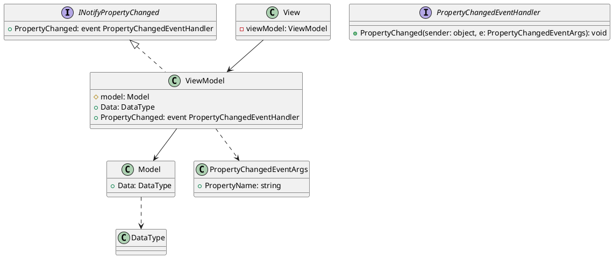

# LoL-MVVM

1. [Qu'est ce que MVVM](#quest-ce-que-mvvm)
    - [Description](#description)
    - [Avantages du MVVM](#avantages-du-mvvm)
    - [Schéma du MVVM (en .NET MAUI)](#schéma-du-mvvm-en-net-maui)
2. [Community Toolkit](#community-toolkit)
    - [Observable Object](#observable-object)
    - [ObservableProperty](#observableproperty)
    - [Relay Command](#relay-command)
    - [NotifyCanExecuteChangedFor](#notifycanexecutechangedfor)
3. [Fontionnalités](#fontionnalités)
# Qu'est ce que MVVM ?

MVVM est un pattern d'architecture logicielle couramment utilisé dans le développement d'applications à interface utilisateur (UI).

## Description
___
Le MVVM repose sur trois composants principaux :

1. **Modèle (Model)** : La représentation des données et de la logique métier de l'application.
2. **Vue (View)** : La partie de l'application qui gère l'affichage de l'interface utilisateur.
3. **VueModèle (ViewModel)** : L'intermédiaire entre la Vue et le Modèle, gérant la logique de présentation.

L'interaction entre ces composants suit un flux unidirectionnel, où les changements dans le Modèle sont propagés vers le VueModèle, qui met à jour la Vue en conséquence. Les actions de l'utilisateur dans la Vue sont gérées par le VueModèle, qui effectue les modifications nécessaires dans le Modèle.

## Avantages du MVVM

- **Séparation de la logique métier** :  Le ViewModel permet de séparer la logique métier de l'interface utilisateur (UI). Cela permet d'obtenir un code plus clair, mieux organisé et plus facile à maintenir.
- **Développement parallèle** : Collaboration efficace entre les développeurs travaillant sur l'interface utilisateur et la logique métier.
- **Testabilité** : Possibilité de tester le VueModèle indépendamment de l'interface utilisateur.
- **Réutilisabilité** : Le VueModèle peut être réutilisé dans différentes vues pour éviter la duplication de code.
- **Maintenance facilitée** : Modifications de l'interface utilisateur sans impact sur la logique métier et vice versa.
- **Liaison de données** : Mécanisme de liaison de données simplifiant la gestion des données dynamiques.

En résumé, l'utilisation du ViewModel dans le modèle-vue-vue modèle (MVVM) offre une meilleure séparation des préoccupations, une réutilisabilité accrue, une testabilité améliorée, une flexibilité dans la conception de l'interface utilisateur et facilite la collaboration entre les développeurs et les concepteurs. Cela conduit à un code plus maintenable, évolutif et de meilleure qualité.

## Schéma du MVVM (en .NET MAUI)



- Le `Model` représente les données et la logique métier.
- Le `ViewModel` agit comme une interface entre le `Model` et la `View`. Il implémente `INotifyPropertyChanged` pour notifier les changements de propriétés à la `View`.
- La `View` est responsable de l'affichage de l'interface utilisateur et peut mettre à jour les données en appelant des méthodes du `ViewModel` par le biais des `Bindings`.
- L'interface `INotifyPropertyChanged` définit l'événement `PropertyChanged` qui est utilisé pour notifier les changements de propriétés du `ViewModel`.
- La classe `PropertyChangedEventArgs` encapsule les informations sur le changement de propriété, tel que le nom de la propriété modifiée.

# Community Toolkit

Le Community utilise les composants suivant :
- `Observable Object`, une classe de base
- `ObservableProperty`, une annotation permettant de la génération de code
- `Relay Command`, une annotation permettant de génerer automatiquement une commande
- `NotifyCanExecuteChangedFor`, une méthode permettant de rafraichir la méthode CanExecute d'une commande

## Observable Object

La classe `ObservableObject` est une classe de base qui permet d'observer les changements des objets en implémentant les interfaces `INotifyPropertyChanged` et `INotifyPropertyChanging`. Elle est utilisée comme point de départ pour tous les types d'objets qui doivent prendre en charge les notifications de changement de propriété.

La classe fournit une série de méthodes `SetProperty` qui facilitent la définition des valeurs des propriétés pour les types dérivés de `ObservableObject` et déclenchent automatiquement les événements appropriés.

Elle expose également les méthodes `OnPropertyChanged` et `OnPropertyChanging`, qui peuvent être personnalisées dans les types dérivés pour modifier la façon dont les événements de notification sont déclenchés.

```csharp

public class ExempleVM : ObservableObject
{
    private Exemple model;

    public string Champ
    {
        get => model.Champ;
        set => SetProperty(model.Champ, value, model, (model, value) => model.Champ = value);
    }
}

```

## ObservableProperty

L'annotation `ObservableProperty` permet de générer automatiquement la propriété sous-jacente correspondante à l'attribut. Pour définir une propriété observable, il faut déclarer un attribut privé avec l'annotation `ObservableProperty`. Cela permet de simplifier la création et la gestion des propriétés observables en générant le code nécessaire à leur implémentation.

> ⚠️ Pour utiliser l'annotation `ObservableProperty`, il est nécessaire que la classe soit déclarée comme partielle, afin que le Toolkit puisse générer les propriétés dans une autre classe partielle portant le même nom.

### **Sans Community Toolkit**
```csharp

public class ClassVM : ObservableObject
{
    public int Exemple
    {
        get => exemple;
        set => SetProperty(ref exemple, value);
    }

    private int exemple;
}
```
### **Avec Community Toolkit**
```csharp

public partial class ClassVM : ObservableObject
{
    [ObservableProperty]
    private int exemple;

}

```

## Relay Command

L'annotation `RelayCommand` permet de générer automatiquement la commande correspondant à une méthode annotée. Pour définir une commande, il suffit d'ajouter l'annotation `RelayCommand` à une méthode de la classe. Cela permet de simplifier la création et la gestion des commandes en générant automatiquement le code nécessaire à leur implémentation.

> ⚠️ Pour utiliser l'annotation `RelayCommand`, il est nécessaire que la classe soit déclarée comme partielle, afin que le Toolkit puisse générer la commande dans une autre classe partielle portant le même nom.

### **Sans Community Toolkit**
```csharp

public class ExempleVM
{
    public ICommand ExempleMethodCommand { get; }

    public ExempleVM()
    {
        ExempleMethodCommand = new Command(execute: ExempleMethod);
    }

    private async void ExempleMethod()
    {
        //Some code
    }
}

```
### **Avec Community Toolkit**
```csharp

public partial class ExempleVM : ObservableObject
{

    public ExempleVM()
    {
    }

    [RelayCommand]
    private async void ExempleMethod()
    {
        //Some code
    }
}

```

## NotifyCanExecuteChangedFor

 Cet appel à la méthode `NotifyCanExecuteChanged()` permet de rafraîchir la méthode `CanExecute()` de la commande, ce qui permet d'obtenir l'état mis à jour du `CanExecute()`. En d'autres termes, cela permet de signaler à la commande qu'un changement s'est produit dans une propriété associée, ce qui peut influencer l'état d'exécution de la commande.

### **Sans Community Toolkit**
```csharp

public class ExempleVM
{
    
    private int index;

    public ICommand ExempleMethodCommand { get; }

    public ExempleVM()
    {
        ExempleMethodCommand = new Command(
            execute: ExempleMethod,
            canExecute: () => page > 0
            );
    }

    private async void ExempleMethod()
    {
        //Code sucspetible de rendre la commande non executable
        index--;
        (ExempleMethodCommand as Command)?.ChangeCanExecute();
    }


}

```
### **Avec Community Toolkit**
```csharp

public partial class ExempleVM : ObservableObject
{
    private int index;

    public ExempleVM()
    {
    }

    [RelayCommand(CanExecute = nameof(CanExempleMethod))]
    private async void ExempleMethod()
    {
        //Code sucspetible de rendre la commande non executable
        index--;
        ExempleMethodCommand.NotifyCanExecuteChanged();
    }

    private bool CanExempleMethod() => index > 0;
}

```

# Fontionnalités


| Intitulé | Fontionnelle | Partiellement fonctionnelle | Non Fonctionnelle | Non fait |
| -------- | ------------ | --------------------------- | ----------------- | -------- |
| Affichage collection champions | X | | | |
| Pagination | X | | | |
| Sélection d'un champion pour voir le détail | X | | | |
| Gestion des caractéristiques | | X (pas de suppression) | | |
| Gestion de la classe du champion | X | | | |
| Modification d'un champion existant (depuis page champion et swipe de l'item) | X | | | |
| Ajout d'un nouveau champion | X | | | |
| Ajouter la gestion des skills | X | | | |
| Ajouter la gestion des skins | | X (besoin de recharger la page pour affichage) | | |

# Bugs connus

`IOS` : la classe actuelle du champion n'est pas sélectionnée lors de son édition

`Android` : les images de la liste ne corrrespondent pas forcément à celle du champion

`Skins` bug lors de la modification d'un skin (il n'est pas supprimé).

# Auteur

- **Jordan Artzet**
