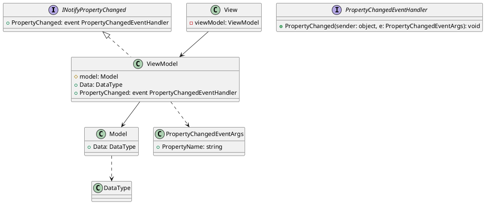
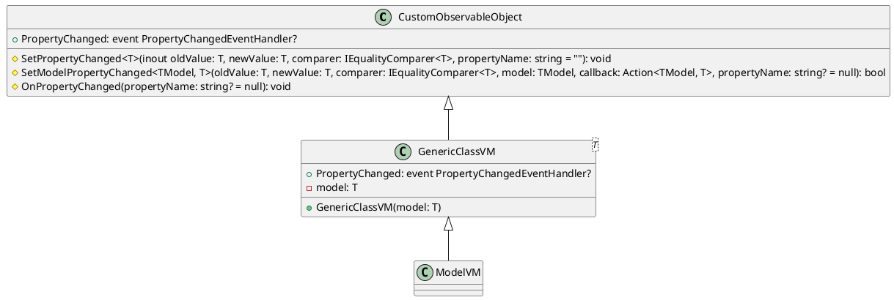

# LoL-MVVM

1. [Qu'est ce que MVVM](#quest-ce-que-mvvm)
    - [Description](#description)
    - [Avantages du MVVM](#avantages-du-mvvm)
    - [Schéma du MVVM (en .NET MAUI)](#schéma-du-mvvm-en-net-maui)
2. [Mon MVVM (Custom Toolkit)](#mvvm-maison-custom-toolkit)
    - [Description](#description-1)
    - [Schéma](#schéma)
    - [Code](#code)
    - [Exemple](#exemple)
3. [Fontionnalités](#fontionnalités)

# Qu'est ce que MVVM ?

MVVM est un pattern d'architecture logicielle couramment utilisé dans le développement d'applications à interface utilisateur (UI).

## Description
___
Le MVVM repose sur trois composants principaux :

1. **Modèle (Model)** : La représentation des données et de la logique métier de l'application.
2. **Vue (View)** : La partie de l'application qui gère l'affichage de l'interface utilisateur.
3. **VueModèle (ViewModel)** : L'intermédiaire entre la Vue et le Modèle, gérant la logique de présentation.

L'interaction entre ces composants suit un flux unidirectionnel, où les changements dans le Modèle sont propagés vers le VueModèle, qui met à jour la Vue en conséquence. Les actions de l'utilisateur dans la Vue sont gérées par le VueModèle, qui effectue les modifications nécessaires dans le Modèle.

## Avantages du MVVM

- **Séparation de la logique métier** :  Le ViewModel permet de séparer la logique métier de l'interface utilisateur (UI). Cela permet d'obtenir un code plus clair, mieux organisé et plus facile à maintenir.
- **Développement parallèle** : Collaboration efficace entre les développeurs travaillant sur l'interface utilisateur et la logique métier.
- **Testabilité** : Possibilité de tester le VueModèle indépendamment de l'interface utilisateur.
- **Réutilisabilité** : Le VueModèle peut être réutilisé dans différentes vues pour éviter la duplication de code.
- **Maintenance facilitée** : Modifications de l'interface utilisateur sans impact sur la logique métier et vice versa.
- **Liaison de données** : Mécanisme de liaison de données simplifiant la gestion des données dynamiques.

En résumé, l'utilisation du ViewModel dans le modèle-vue-vue modèle (MVVM) offre une meilleure séparation des préoccupations, une réutilisabilité accrue, une testabilité améliorée, une flexibilité dans la conception de l'interface utilisateur et facilite la collaboration entre les développeurs et les concepteurs. Cela conduit à un code plus maintenable, évolutif et de meilleure qualité.

## Schéma du MVVM (en .NET MAUI)



- Le `Model` représente les données et la logique métier.
- Le `ViewModel` agit comme une interface entre le `Model` et la `View`. Il implémente `INotifyPropertyChanged` pour notifier les changements de propriétés à la `View`.
- La `View` est responsable de l'affichage de l'interface utilisateur et peut mettre à jour les données en appelant des méthodes du `ViewModel` par le biais des `Bindings`.
- L'interface `INotifyPropertyChanged` définit l'événement `PropertyChanged` qui est utilisé pour notifier les changements de propriétés du `ViewModel`.
- La classe `PropertyChangedEventArgs` encapsule les informations sur le changement de propriété, tel que le nom de la propriété modifiée.

# MVVM maison (Custom Toolkit)

## Description

Le but de ce toolkit personnalisé est de simplifier la création de ViewModel des classes du modèle.


## Schéma



`CustomObservableObject` est la classe qui est la base de mon toolkit, elle implémente l'interface `INotifyPropertyChanged` et a 2 méthode différentes : 
- `SetPropertyChanged` permettant de modifier une propriété passé par référence dans la méthode
- `SetModelPropertyChanged` permettant de modifier une propriété du modèle

`GenericClassVM` est une classe qui hérite de `CustomObservableObject` par ce biais elle implémente `INotifyPropertyChanged` et peux utiliser les 2 méthodes de `CustomObservableObject`. Lorqu'elle est instanciée 

`ModelVM` représente une classe du ViewModel qui wrappe une classe de notre modèle elle hérite de `GenericClassVM<T>` avec T la classe du modèle

## Code

### CustomObservableObject

```csharp

	public abstract class CustomObservableObject : INotifyPropertyChanged
	{
        public event PropertyChangedEventHandler? PropertyChanged;

        /// <summary>
        /// Set property changed for a property
        /// </summary>
        /// <param name="oldValue">Base value</param>
        /// <param name="newValue">Value to set</param>
        /// <param name="comparer">The comparer use to compare value</param>
        /// <param name="propertyName">The name of the property</param>
        /// <typeparam name="T">Type of the property</typeparam>        
        protected void SetPropertyChanged<T>([NotNullIfNotNull(nameof(newValue))] ref T oldValue, T newValue, IEqualityComparer<T> comparer , [CallerMemberName] string propertyName = "")
        {
            if (comparer.Equals(oldValue, newValue))
                return;

            oldValue = newValue;
            OnPropertyChanged(propertyName);

        }

        /// <summary>
        /// Set property changed for a property of an object (model)
        /// </summary>
        /// <typeparam name="TModel">Object (Model) type</typeparam>
        /// <typeparam name="T">Property type</typeparam>
        /// <param name="oldValue">Base value</param>
        /// <param name="newValue">Value to set</param>
        /// <param name="comparer">The comparer used to compare the values</param>
        /// <param name="model">The object (model) which contains the property</param>
        /// <param name="callback">The callback we use to assign the value to the property in the model</param>
        /// <param name="propertyName">The name of the property</param>
        /// <returns></returns>
        protected bool SetModelPropertyChanged<TModel, T>(T oldValue, T newValue, IEqualityComparer<T> comparer, TModel model, Action<TModel, T> callback, [CallerMemberName] string? propertyName = null)
                where TModel : class
        {
            ArgumentNullException.ThrowIfNull(comparer);
            ArgumentNullException.ThrowIfNull(model);
            ArgumentNullException.ThrowIfNull(callback);

            if (comparer.Equals(oldValue, newValue)) return false;

            callback(model, newValue);

            OnPropertyChanged(propertyName);

            return true;
        }

        protected virtual void OnPropertyChanged([CallerMemberName] string? propertyName = null)
        {
            PropertyChanged?.Invoke(this, new PropertyChangedEventArgs(propertyName));
        }


    }


```

### GenericClassVM

```csharp

	public class GenericClassVM<T> : CustomObservableObject
	{

        public event PropertyChangedEventHandler? PropertyChanged;

        protected T model;

		protected GenericClassVM(T model)
		{
			this.model = model;
		}

	}
```

## Exemple

### Sans le MVVM maison
---
Pour configurer une propriété de notre ViewModel pour qu'elle notifie la vue d'un changement dans le modèle, il faut configurer chacun des champs (ayant un type primitif) que l'on souhaite modifiable de notre modèle et implémenter INotifyPropertyChanged dans notre classe pour qu'elle soit capable de notifier la vue d'un changement de notre modèle

```csharp

public class ModelVM : INotifyPropertyChanged {

    public event PropertyChangedEventHandler? PropertyChanged;

    protected virtual void OnPropertyChanged([CallerMemberName] string? propertyName = null)
    {
        PropertyChanged?.Invoke(this, new PropertyChangedEventArgs(propertyName));
    }

    private Model model;

    public string Description {
        get => model.Description;
        set 
        {
            if(model.Description.Equals(value)) 
                return;
            model.Description = value;
            NotifyPropertyChanged();

        }
    }
}

```

### Avec le MVVM maison
___

Notre classe `ModelVM` hérite de GenericClassVM\<Model> donc de `CustomObservableObject` et implémente donc `INotifyPropertyChanged`. Nous n'avons donc plus besoin d'implémenter le système de notifications comme au dessus. Nous pouvons nous contenter d'appeler la méthode `SetModelPropertyChanged` pour wrapper une propriété du modèle.

```csharp

public class ModelVM : GenericClassVM<Model> {

    public string Description {
        get => model.Description;
        set => SetModelPropertyChanged(
            model.Description,                 //Champ du modèle que l'on souhaite modifier
            value,                             //Valeur avec laquelle on veut modifier le champ
            EqualityComparer<string>.Default,  //Le comparer qui sera utilisé pour comparer nos valeurs
            model,                             //Notre modèle wrappé
            (model, value) => { model.Description = value; }    //La callback que l'on appellera si jamais les 2 valeurs ne sont pas égales
            );
    }
}

```

# Fontionnalités


| Intitulé | Fontionnelle | Partiellement fonctionnelle | Non Fonctionnelle | Non fait |
| -------- | ------------ | --------------------------- | ----------------- | -------- |
| Affichage collection champions | X | | | |
| Pagination | X | | | |
| Sélection d'un champion pour voir le détail | X | | | |
| Gestion des caractéristiques | | X (pas de suppression) | | |
| Gestion de la classe du champion | X | | | |
| Modification d'un champion existant (depuis page champion et swipe de l'item) | X | | | |
| Ajout d'un nouveau champion | X | | | |
| Ajouter la gestion des skills | X | | | |
| Ajouter la gestion des skins | | X (besoin de recharger la page pour affichage) | | |

# Bugs connus

`IOS` : la classe actuelle du champion n'est pas sélectionnée lors de son édition

`Android` : les images de la liste ne corrrespondent pas forcément à celle du champion

`Skins` bug lors de la modification d'un skin (il n'est pas supprimé).

# Auteur

- **Jordan Artzet**


